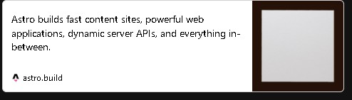
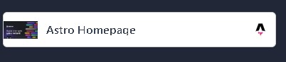
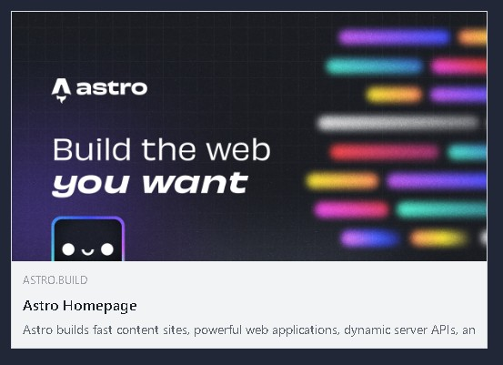
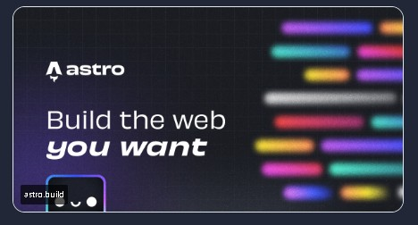
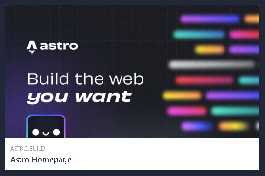
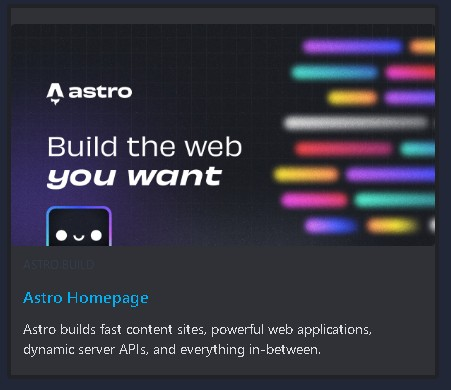

# astro-static-link-preview

[](https://www.npmjs.com/package/astro-static-link-preview) 
[](https://www.npmjs.com/package/astro-static-link-preview) 
[](https://github.com/NPJigaK/astro-static-link-preview/blob/main/LICENSE)  

**A zero-dependency** Astro component that turns any URL into a social-style link-preview card entirely at build time.
**No external libraries**, **no runtime JavaScript**, and **no network calls** during generation—just compact, tree-shakable HTML + CSS.
Choose from six built-in themes (`default`, `small`, `facebook`, `x`, `linkedin`, `discord`) or roll your own with CSS variables.

---

## Features

|  |  |
|---|---|
| **Static rendering** | No client-side fetches — perfect for blogs, docs & MDX content. |
| **Six ready-made themes** | Recreate the look of Facebook, X (Twitter), LinkedIn, Discord, etc. |
| **Type-safe** | Exports an interface for all props. |
| **A zero-dependency and Pure CSS** | No external style sheets or JS bundles. |
---

## install
```bash
# choose one
npm i astro-static-link-preview
yarn add astro-static-link-preview
pnpm add astro-static-link-preview
```

## Usage
### 1. Import
`.astro`
```astro
---
import { LinkPreview } from "astro-static-link-preview";
---
```

`.mdx`
```mdx
import { LinkPreview } from "astro-static-link-preview";
```

### 2. Drop in a component
```mdx
<LinkPreview
  url="https://astro.build"
  title="Astro Homepage"
  description="Astro builds fast content sites, powerful web applications, dynamic server APIs, and everything in-between."
  image="https://astro.build/og/astro.jpg"
/>
```


```mdx
<LinkPreview
  url="https://astro.build"
  title="Astro Homepage"
  description="Astro builds fast content sites, powerful web applications, dynamic server APIs, and everything in-between."
  image="https://astro.build/og/astro.jpg"
  theme="small"
/>
```


```mdx
<LinkPreview
  url="https://astro.build"
  title="Astro Homepage"
  description="Astro builds fast content sites, powerful web applications, dynamic server APIs, and everything in-between."
  image="https://astro.build/og/astro.jpg"
  theme="facebook"
/>
```


```mdx
<LinkPreview
  url="https://astro.build"
  title="Astro Homepage"
  description="Astro builds fast content sites, powerful web applications, dynamic server APIs, and everything in-between."
  image="https://astro.build/og/astro.jpg"
  theme="x"
/>
```


```mdx
<LinkPreview
  url="https://astro.build"
  title="Astro Homepage"
  description="Astro builds fast content sites, powerful web applications, dynamic server APIs, and everything in-between."
  image="https://astro.build/og/astro.jpg"
  theme="linkedin"
/>
```


```mdx
<LinkPreview
  url="https://astro.build"
  title="Astro Homepage"
  description="Astro builds fast content sites, powerful web applications, dynamic server APIs, and everything in-between."
  image="https://astro.build/og/astro.jpg"
  theme="discord"
/>
```


## API


Prop | Type | Default | Description
|---|---|---|---|
url | string (required) | – | Absolute URL to link to.
title | string (required) | "" | – | Heading text (can contain markup).
description | string | "" | descriptive text (`default`, `facebook`,  `discord`).
image | string | null | image / screenshot URL. When omitted, an SVG placeholder(Not Found Image) is shown.
imageAlt | string | "" | Alt text for the image.
theme | string | "default" | Card style. (`default`, `small`, `facebook`, `x`, `linkedin`, `discord`)

## License
[MIT](LICENSE)
